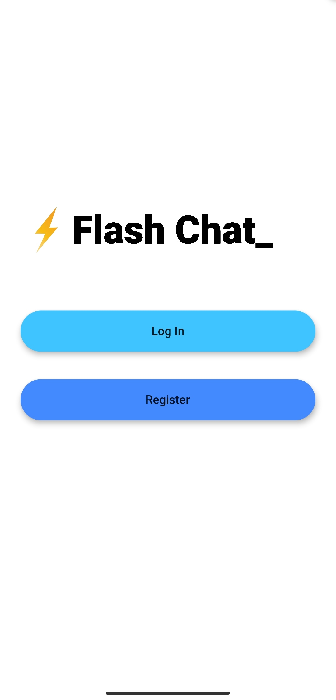

# Flash Chat ⚡️ 

*Flash Chat is a mobile chat app built using **Flutter** and
**Firebase** that incorporates animations and file streams to
facilitate real-time communication.*

<p align="center">

&nbsp;
&nbsp;
&nbsp;

## Getting Started

In the main project directory:

1. Download all necessary dependencies mentioned in `pubspec.yaml` with:
```
flutter pub get
```

2. Configure the `android/gradle` files to secure a connection between the app and your *Firebase* account.

3. Run the app in debug mode to enable hot reloading.

You can now interact with the application and chat with your friends.